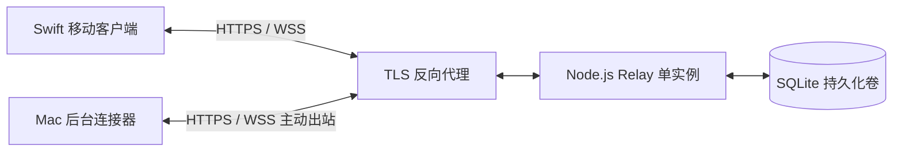

# GitGatto Relay

GitGatto 移动端的公网连接后端，使用 TypeScript、Node.js、Fastify 和 SQLite。未来的 iPhone／iPad 客户端使用 Swift；本服务不依赖 Swift，也不打进 macOS 安装包。

**当前是可本地运行和测试的后端实现，尚未部署，也尚未接入正式的手机和 Mac 客户端。**

## 已实现

- 电脑发起配对、手机领取配对邀请、电脑确认手机身份与可访问仓库。
- Ed25519 请求签名、时间窗口与持久化 nonce 防重放。
- WebSocket 在线状态及消息到达通知；通过签名 HTTP 接口收发加密消息。
- SQLite 持久化收件箱、重连补取、收件确认、重复发送去重、过期清理。
- 撤销配对、清除该配对的待收消息、关闭失去全部配对权限的连接。
- 心跳、旧连接替换、请求频率和队列容量限制、正常退出。

本服务不读取仓库、不调用模型、不执行 Shell，也不接收 GitHub 或 Agent API Key。它保存设备公钥、配对关系、获准的仓库标识、在线时间、消息路由信息和短期密文。

## 本地运行

需要 Node.js 24.14 及以上版本（24／26 系列）和 npm。依赖固定在 `package-lock.json`。

```sh
cd Development/mobile-remote/Backend/relay
npm ci --ignore-scripts
npm run check
```

启动时必须提供获准注册的**电脑 Ed25519 公钥**，格式为 32 字节原始公钥的小写十六进制，多个公钥以逗号分隔。这不是私钥或 API Key。

```sh
export RELAY_HOST_KEYS='<电脑客户端生成的公钥，64 位小写十六进制>'
npm run build
npm start
```

示例中的公钥必须替换。当前没有正式客户端生成公钥的界面，联调可先运行测试，测试会临时生成独立设备身份、创建隔离数据库并清理，不使用个人凭据。

```sh
curl --fail http://127.0.0.1:8787/healthz
```

| 配置 | 默认值 | 用途 |
| --- | --- | --- |
| `RELAY_HOST_KEYS` | 无，必填 | 获准创建配对的电脑公钥；从配置移除只禁止新建配对，已有配对需调用撤销接口 |
| `RELAY_BIND` | `127.0.0.1` | 监听地址 |
| `RELAY_PORT` | `8787` | 监听端口 |
| `RELAY_DATA_DIR` | `./data` | 持久化 SQLite 目录 |
| `RELAY_TRUST_PROXY` | 空 | 明确信任的反向代理 IP，逗号分隔；不支持任意信任所有来源 |

## 公网部署方式



手机和电脑都主动访问服务器，不要求同一 Wi-Fi，也不需要给家里的路由器开入站端口。服务本身默认只监听回环地址；公网 HTTPS/WSS 由反向代理终止 TLS。

部署要求：

1. 使用域名和有效 TLS 证书，手机与电脑必须校验证书。**不要把裸 HTTP 服务端口直接开放到公网。**
2. 只运行一个服务实例，挂载独立、持久化、权限受限的数据目录。不支持多副本共享同一 SQLite 文件。
3. 代理必须转发 WebSocket Upgrade；空闲超时大于 45 秒；限制请求体和连接数。
4. 仅把实际代理 IP 加入 `RELAY_TRUST_PROXY`，代理覆盖而不是盲目信任客户端提供的转发头。未配置时按 TCP 对端限流，经过代理的客户端会共享该 IP 的限额。
5. 代理日志不得记录签名认证头、邀请内容、请求体或密文。API 不接受 query 参数，凭据不能放 URL。
6. 保留 SQLite 的 WAL／SHM 文件。备份使用 SQLite 备份工具，或正常停服后复制整个数据目录，不在运行中单独复制主数据库文件。
7. 监控 `/healthz`、进程退出、磁盘和错误率；设置磁盘加密。删除密文不是对底层磁盘或旧备份的安全擦除保证。

提供了 `Dockerfile`。从本目录构建，发布时只暴露给反向代理：

```sh
docker build -t gitgatto-relay:local .
docker run --rm --name gitgatto-relay \
  -p 127.0.0.1:8787:8787 \
  -e RELAY_HOST_KEYS \
  -v gitgatto-relay-data:/app/data \
  gitgatto-relay:local
```

Docker 配置需要在目标 Linux 主机实际构建验证；当前本机没有运行中的 Docker 服务。

## 客户端与安全边界

完整字段、签名格式、加密格式和连接事件见 [PROTOCOL.md](PROTOCOL.md)。

- 公钥白名单用于当前阶段的受控设备接入，不是已经完成了面向所有用户的账号注册系统。
- 协议支持客户端端到端加密，并有双设备加解密测试。中转端不能判断任意传入字节是否真的加密；正式客户端必须验证配对身份、固定对端密钥并执行加密。
- 仓库标识限制的是路由范围。电脑执行端仍需将标识映射到获准目录，检查任务权限、命令、路径和具体改动确认，不能信任消息自称“已授权”。
- 收件 ACK 表示接收端已持久化收到消息，不表示任务成功。接收端需要按任务 ID 去重执行，记录结果，并在仓库状态变化后重新请求写入确认。
- 密文最长排队 10 分钟；对写入任务，客户端应设置更短的有效期。过期任务不能在电脑上线后自动补执行。
- WebSocket 通知不等于 APNs 推送。手机挂起后不能靠后台常驻 WebSocket 收通知；APNs、账号系统、正式客户端执行与公网运行验证尚未实现。
- 当前加密方案不包含前向保密或双棘轮；设备长期加密私钥泄露可能暴露被记录的历史消息。正式公开运营前需安全复核和密钥轮换方案。

## 测试

`npm run check` 执行类型检查、测试与构建。测试覆盖配对授权、过期邀请、请求签名及重放、跨设备／仓库隔离、密文传输、消息去重、确认、队列上限、进程强制中断后的恢复、真实 TCP/WebSocket 连接、撤销、心跳与正常退出。

测试只终止自己启动的服务进程，并只删除自己创建的临时目录。
