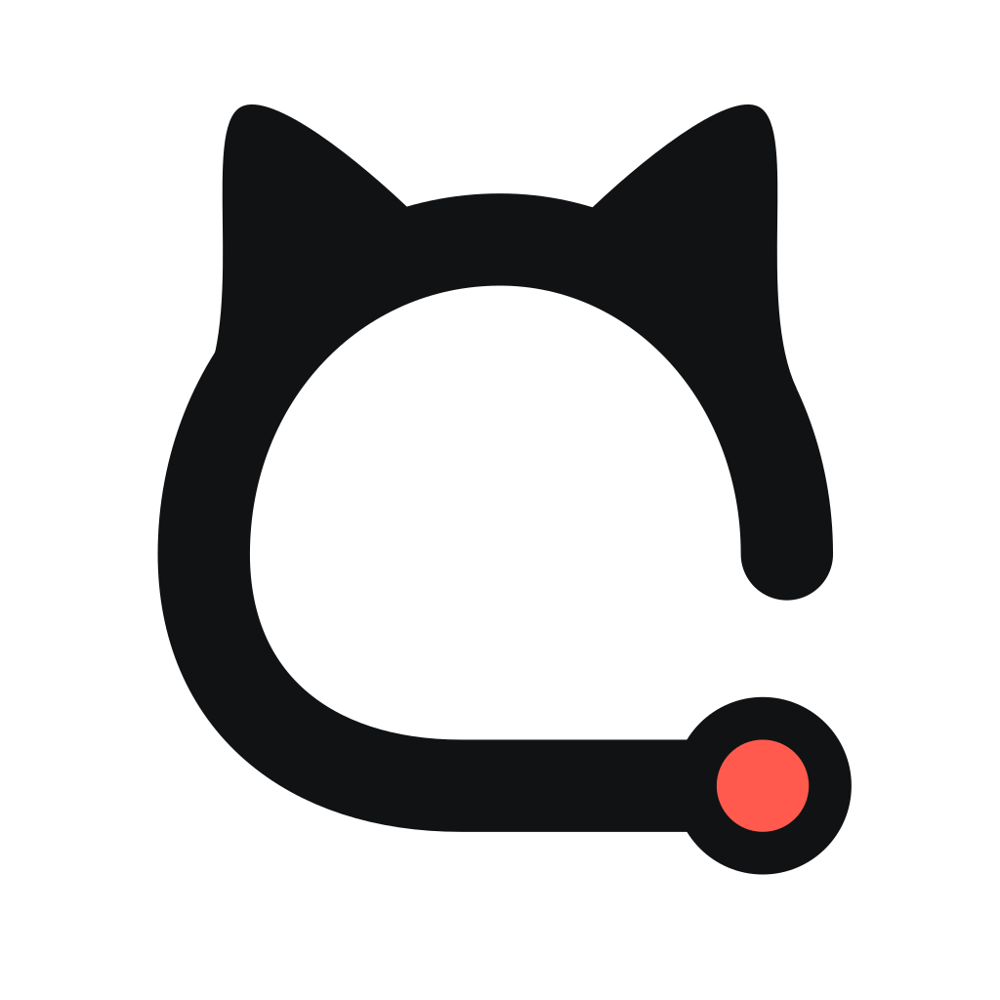
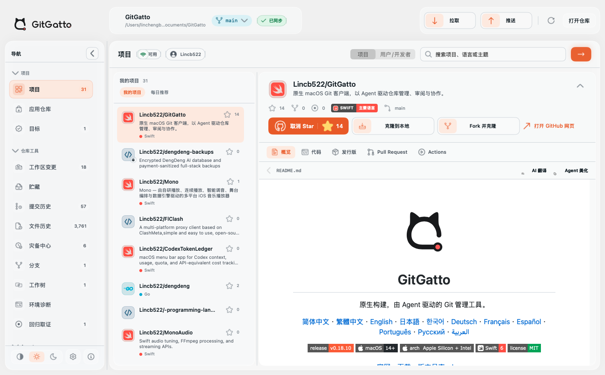
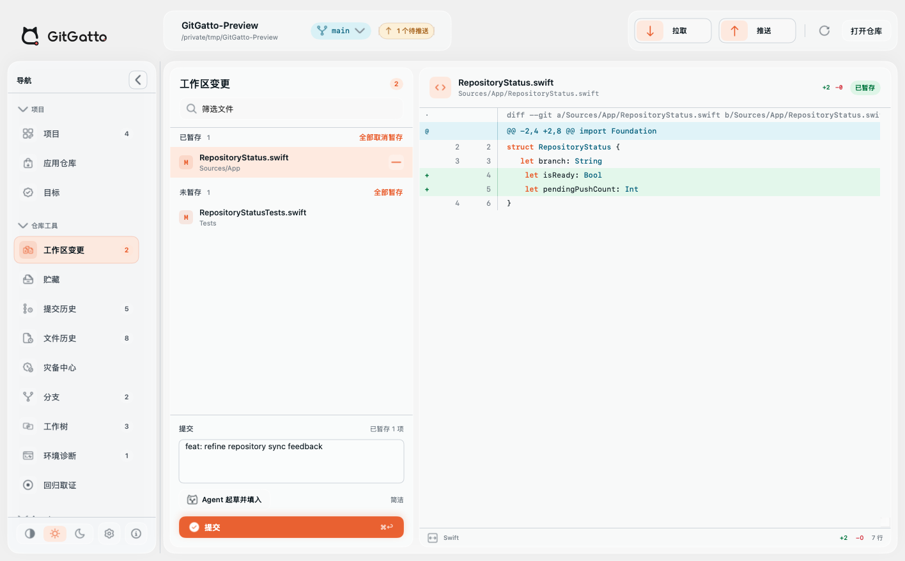
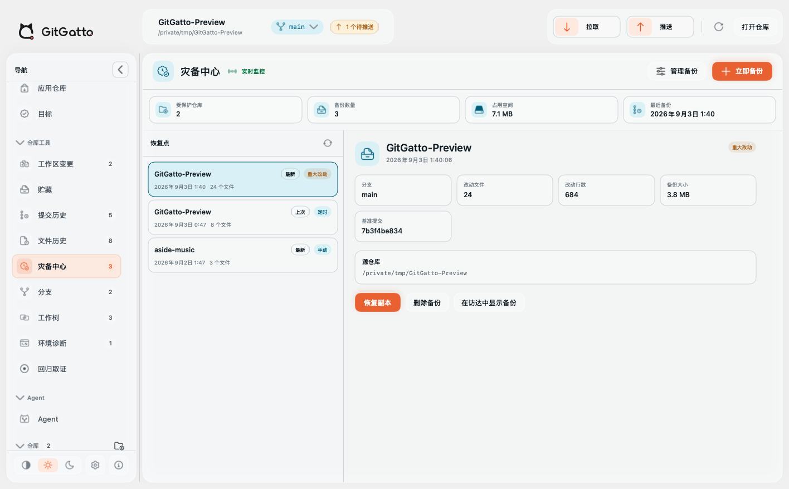
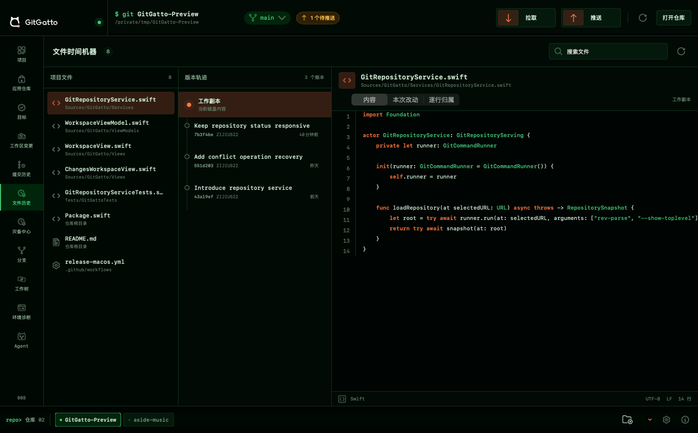
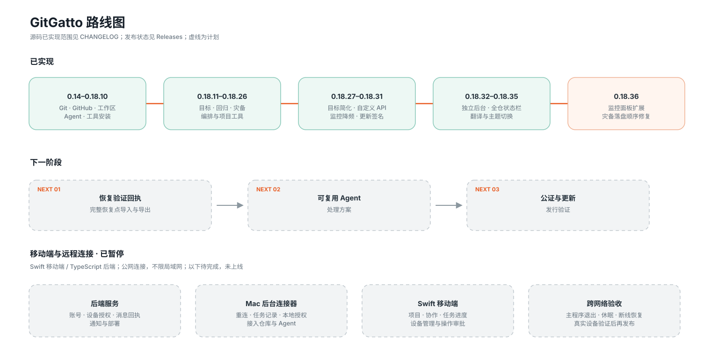
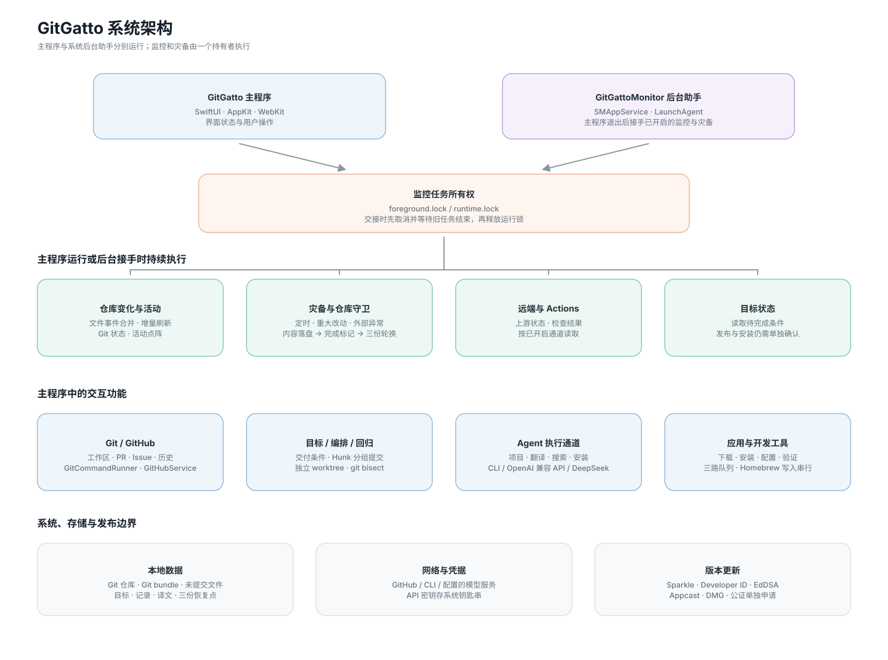
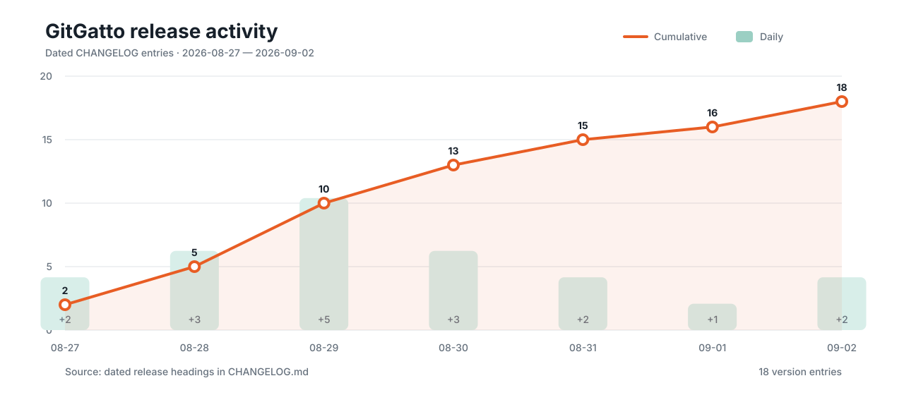

<p align="center">
  <picture>
    <source media="(prefers-color-scheme: dark)" srcset="Assets/GitGatto-AppIcon-Dark.svg">
    
  </picture>
</p>

<h1 align="center">GitGatto</h1>

<p align="center">Ein nativer, Agent-gesteuerter Git-Client.</p>

<p align="center">
  <a href="README.md">简体中文</a> · <a href="README.zh-Hant.md">繁體中文</a> · <a href="README.en.md">English</a> · <a href="README.ja.md">日本語</a> · <a href="README.ko.md">한국어</a> · <a href="README.de.md">Deutsch</a> · <a href="README.fr.md">Français</a> · <a href="README.es.md">Español</a> · <a href="README.pt-BR.md">Português</a> · <a href="README.ru.md">Русский</a> · <a href="README.ar.md">العربية</a>
</p>

<p align="center">
  <a href="https://github.com/Lincb522/GitGatto/releases/latest"></a>
  
  
  
  <a href="LICENSE"></a>
</p>

<p align="center"><a href="https://gatto.zijiu522.cn">Website</a> · <a href="https://github.com/Lincb522/GitGatto/releases/latest">Download</a> · <a href="CHANGELOG.md">Änderungsprotokoll</a> · <a href="https://github.com/Lincb522/GitGatto/issues">Issues</a></p>

<table>
  <tr>
    <td width="50%" align="center"><br><sub><b>GitHub-Projekt</b></sub></td>
    <td width="50%" align="center"><br><sub><b>Arbeitsbaum und Diff</b></sub></td>
  </tr>
  <tr>
    <td width="50%" align="center"><br><sub><b>Wiederherstellungszentrale</b></sub></td>
    <td width="50%" align="center"><br><sub><b>Dateiverlauf im Dunkelmodus</b></sub></td>
  </tr>
</table>

GitGatto ist ein nativer Git- und GitHub-Client für macOS. Der Repository-Status kommt vom Git des Systems, Remote-Aktionen laufen über die GitHub CLI und Agents verwenden bereits installierte und angemeldete CLI-Werkzeuge. GitGatto führt deren Status, Schritte und Ergebnisse in einer Projektansicht zusammen.

## Warum GitGatto entwickelt wurde

Eine vollständige Auslieferung verteilt sich oft auf Terminal, Editor, GitHub, Actions und die Release-Seite. Scheitert ein Schritt, müssen Branch, Staging-Bereich, Laufprotokolle und Artefakte erneut geprüft werden. Bei einem Agent kommen Arbeitsverzeichnis, Berechtigungen und der Bezug seines Kontexts zum aktuellen Repository hinzu.

GitGatto entstand aus diesen praktischen Problemen. Das echte Git und vorhandene Werkzeuge bleiben erhalten; Repository-Aktionen, Zusammenarbeit auf GitHub, Agent-Aufgaben und Fehlernachweise werden zu einem Ablauf verbunden, der geprüft, angehalten und fortgesetzt werden kann.

## Besondere Arbeitsabläufe

### Projektziele

„Aktuelle Änderungen ausliefern“, „GitHub-Auslieferung“ und „Vollständiges Release“ prüfen Staging, Commits, Push, Pull Request, Reviews, Actions, Artefakte, Release, DMG, Appcast und die lokal installierte Version in Abhängigkeitsreihenfolge. Ein Ziel kann auch in natürlicher Sprache beschrieben und seine erzeugten Bedingungen vor der Ausführung geprüft werden.

Jeder Schritt liest den tatsächlichen Zustand von Git, GitHub oder dem Mac. Abgeschlossene Schritte bleiben nach einer Unterbrechung erhalten; ein fehlgeschlagener Actions-Lauf kann mitsamt Nachweisen an einen Agent übergeben werden. Merge, Veröffentlichung eines Tags und Installation benötigen weiterhin eine eigene Bestätigung.

### Regressionssuche

`git bisect` läuft in einem isolierten worktree, ohne den aktuellen Arbeitsbereich umzuschalten. Der automatische Modus führt einen gewählten Prüfbefehl aus, der manuelle Modus bewertet Kandidaten als korrekt, fehlerhaft oder übersprungen. Kandidaten, Exit-Codes, Laufzeit und Ausgabe werden gespeichert. Nach dem ersten fehlerhaften Commit kann ein Agent die Korrektur vorbereiten, erneut prüfen und einen Pull Request erstellen.

### Repository-Wiederherstellung

Das Wiederherstellungszentrum überwacht lokale Repositories, die GitGatto hinzugefügt wurden. Es sichert nicht übertragene Arbeit nach Zeitplan, erzeugt bei erreichten Datei- oder Zeilenschwellen sofort einen Wiederherstellungspunkt und unterstützt manuelle Sicherungen. Unveränderte Inhalte werden nicht erneut geschrieben.

Ein Wiederherstellungspunkt enthält ein Git-Bundle und Kopien nicht übertragener Dateien. Pro Repository bleiben höchstens drei rollierende Punkte erhalten. Speicherverbrauch, Sicherungsordner, einzelne oder vollständige Repository-Sicherungen lassen sich verwalten; ein Punkt wird als neue Repository-Kopie wiederhergestellt. Beim Wechsel des Speicherorts werden vorhandene Daten migriert und vor der Umschaltung geprüft.

### Git-orientierte Agents

Unterstützt werden Codex CLI, Claude Code, Gemini CLI, OpenCode und eigene CLI-Vorlagen. Repository-Aufgaben, Übersetzung und Softwareinstallation nutzen getrennte Ausführungskanäle, damit eine lange Repository-Aufgabe keine Dokumentübersetzung blockiert.

Ein Agent kann vollständige Fehlerausgaben zu Git, Git LFS, Hooks, Signaturen, Branches, Synchronisierung, Konflikten, Pull Requests und Actions verarbeiten. Ist nichts vorgemerkt, kann die Commit-Erstellung zuerst die aktuellen Änderungen stagen und anschließend committen oder committen und pushen. Eine README-Überarbeitung wird vollständig gerendert, bevor „Commit anwenden“ ausschließlich dieses Dokument übernimmt.

## Git und GitHub

- Arbeitsverzeichnis, Staging, Commits, Pull, Push, Branches, Stashes und worktrees verwalten.
- Zeilendiffs, Commit-Graph, Blame, Dateiverlauf sowie Bilder, SVGs und Videos älterer Revisionen ansehen.
- Ergebnisse von Merge-, Rebase- und Stash-Konflikten bearbeiten und fortsetzen, überspringen oder abbrechen.
- Für das aktuelle GitHub-Konto zugängliche Repositories laden; Repositories und Entwickler unscharf, in natürlicher Sprache und mit weiteren Ergebnisseiten suchen.
- Code, README, Pull Requests, Actions, Releases und Release-Dateien innerhalb der App lesen.
- Pull-Request-Dateien prüfen, als angesehen markieren, Zeilen kommentieren, antworten und Reviews senden; Actions neu starten oder abbrechen und Artefakte laden.
- Repositories markieren, forken und klonen. Die lokale Suche wird manuell gestartet und importiert nur ausgewählte Repositories statt eines ganzen Datenträgers.

## Dokumente, Übersetzung und Vorschau

- Markdown, relative Bilder und interne Links eines Repositories direkt in GitGatto darstellen.
- Dokumentsprache automatisch erkennen und über einen eigenen Agent-Kanal übersetzen; Übersetzungen werden nach Quellversion lokal gespeichert.
- Quellcode, Bilder, SVG-Quelltext und Medien aus Arbeitsbereich, Commit- und Dateiverlauf anzeigen.
- Der README-Agent baut die Struktur anhand von Repository-Dateien, Abhängigkeiten und vorhandenen Medien neu auf, statt nur Formulierungen zu ersetzen.

## App-Katalog und Entwicklungswerkzeuge

- Installierbare Anwendungen aus GitHub Releases mit echten Symbolen, Beschreibung, Screenshots, Version und Paketen finden. DMG und ZIP verwenden den lokalen Installer, andere Formate einen Agent.
- Installierte Versionen und Updates für 99 Laufzeiten, Build-, Container- und Cloud-Werkzeuge, Datenbanken und CLI-Programme erkennen.
- Installationen und Upgrades in drei parallelen Spuren mit Mehrfachauswahl und Stapel-Upgrade ausführen. Homebrew-Änderungen laufen seriell, um gleichzeitige Schreibzugriffe auf Cellar zu vermeiden.
- Nach der Installation richtet der Agent benutzerspezifischen PATH, Komponentenregistrierung, Initialisierung und Konfigurationsmigration ein und prüft Programm und Version erneut.
- Fortschritt, Originalausgabe und lokalisierte Erklärungen bekannter Fehler bleiben für Download, Installation, Konfiguration und Prüfung erhalten.

## Projektdokumente

- [Roadmap](docs/ROADMAP.md): implementierte Etappen, geplante Arbeit und Grenzen.
- [Architektur](docs/ARCHITECTURE.md): Zuständigkeit für Zustände, Servicegrenzen und zentrale Datenflüsse.
- [Release-Kurve](docs/UPDATE_HISTORY.md): aus datierten CHANGELOG-Einträgen erzeugter Versionsverlauf.







## Installation

DMG unter [Releases](https://github.com/Lincb522/GitGatto/releases/latest) laden und GitGatto nach „Programme“ ziehen. Die Releases sind Universal-Binaries für Apple Silicon und Intel und benötigen macOS 14 oder neuer.

| Funktion | Voraussetzung |
| --- | --- |
| Lokale Repositories | Git |
| GitHub-Repositories, PRs, Actions und Remote-Aktionen | Angemeldete [GitHub CLI](https://cli.github.com/) |
| Agent-Abläufe | Mindestens eine installierte und angemeldete unterstützte CLI |
| Homebrew-Updateprüfung | Homebrew |

Updates, Versionshinweise und Installationspakete in der App stammen aus den GitHub Releases dieses Repositories.

## Lokale Daten und Berechtigungen

- Einstellungen, Repository-Liste, Projektziele, Regressionsuntersuchungen, Agent-Dialoge und -Protokolle, Downloads und Übersetzungen bleiben auf dem Mac.
- Bei aktivierter Repository-Sicherung werden Git-Bundles und Kopien nicht übertragener Dateien in Application Support oder am gewählten Ort gespeichert. Pro Repository bleiben höchstens drei Kopien, die im Wiederherstellungszentrum gelöscht werden können.
- Git, SSH, GitHub CLI und Agent-CLIs nutzen weiterhin ihre eigenen Zugangsdaten. GitGatto speichert keine Tokens, Passwörter oder privaten Schlüssel.
- Pull, Push, Fork, Kommentare, Reviews, Actions, App-Installationen und Änderungen an Entwicklungswerkzeugen laufen nur nach einer ausdrücklichen Aktion in der App.

## Entwicklung

Benötigt werden macOS 14 oder neuer und die vom Projekt angegebene Swift-Toolchain.

```bash
git clone https://github.com/Lincb522/GitGatto.git
cd GitGatto
swift package resolve
swift test
open GitGatto.xcodeproj
```

Der Quellcode verwendet Swift 6, SwiftUI, AppKit, WebKit und AVKit; für Netzwerkzugriffe Alamofire 5.12 und für Updates Sparkle 2.9.6. Regeln für Beiträge stehen in [CONTRIBUTING.md](CONTRIBUTING.md), Systemgrenzen in [docs/ARCHITECTURE.md](docs/ARCHITECTURE.md).

## Danksagung

- [Sparkle](https://github.com/sparkle-project/Sparkle)
- [Alamofire](https://github.com/Alamofire/Alamofire)
- [SwiftUI-Animations](https://github.com/Shubham0812/SwiftUI-Animations)
- [GitHub CLI](https://github.com/cli/cli)
- [Simple Icons](https://github.com/simple-icons/simple-icons), [VSCode Icons](https://github.com/vscode-icons/vscode-icons), [Devicon](https://github.com/devicons/devicon) und [Material Icon Theme](https://github.com/material-extensions/vscode-material-icon-theme)

Genaue Versionen und Lizenzen stehen in [THIRD_PARTY_NOTICES.md](THIRD_PARTY_NOTICES.md). Sicherheitsprobleme bitte über den in [SECURITY.md](SECURITY.md) beschriebenen Weg melden.

## Lizenz

GitGatto wird von **ZIJIU522** entwickelt und unter der [MIT-Lizenz](LICENSE) veröffentlicht.
