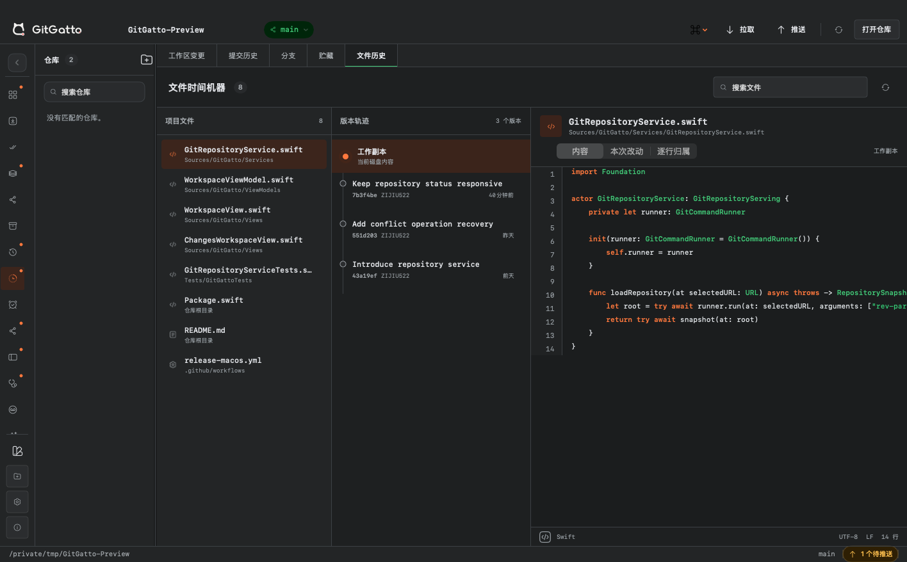
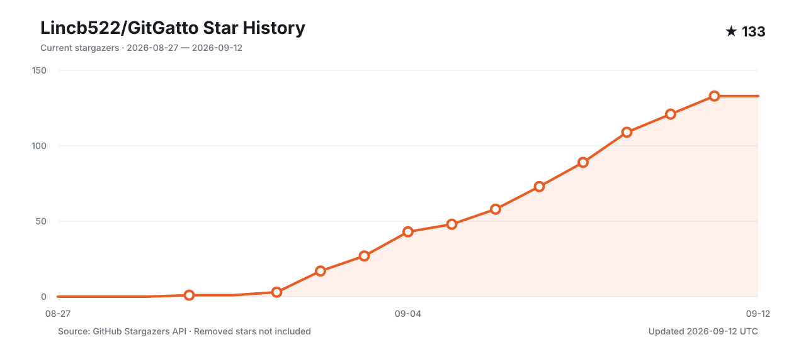

<p align="center">
  <picture>
    <source media="(prefers-color-scheme: dark)" srcset="Assets/GitGatto-AppIcon-Dark.svg">
    
  </picture>
</p>

<h1 align="center">GitGatto</h1>

<p align="center">macOS ネイティブで、Agent 駆動の Git クライアント。</p>

<p align="center">
  <a href="README.md">简体中文</a> ·
  <a href="README.zh-Hant.md">繁體中文</a> ·
  <a href="README.en.md">English</a> ·
  <a href="README.ja.md">日本語</a> ·
  <a href="README.ko.md">한국어</a> ·
  <a href="README.de.md">Deutsch</a> ·
  <a href="README.fr.md">Français</a> ·
  <a href="README.es.md">Español</a> ·
  <a href="README.pt-BR.md">Português</a> ·
  <a href="README.ru.md">Русский</a> ·
  <a href="README.ar.md">العربية</a>
</p>

<p align="center">
  <a href="https://github.com/Lincb522/GitGatto/releases/latest"></a>
  
  
  
  <a href="LICENSE"></a>
</p>

<p align="center">
  <a href="https://gatto.zijiu522.cn">Web サイト</a>
  ·
  <a href="https://github.com/Lincb522/GitGatto/releases/latest">ダウンロード</a>
  ·
  <a href="CHANGELOG.md">変更履歴</a>
  ·
  <a href="https://github.com/Lincb522/GitGatto/issues">Issues</a>
</p>

<table>
  <tr>
    <td width="50%" align="center"><br><sub><b>GitHub プロジェクト</b></sub></td>
    <td width="50%" align="center"><br><sub><b>ワークツリーと Diff</b></sub></td>
  </tr>
  <tr>
    <td width="50%" align="center"><br><sub><b>リカバリーセンター</b></sub></td>
    <td width="50%" align="center"><br><sub><b>ファイルタイムマシン</b></sub></td>
  </tr>
</table>

GitGatto は macOS 向けのネイティブ Git／GitHub クライアントです。リポジトリの状態はシステムの Git から取得し、リモート操作には GitHub CLI、Agent には Mac にインストール済みでログイン済みの CLI を使います。それぞれの状態、手順、結果を一つのプロジェクト画面にまとめます。

## GitGatto を作った理由

一度のリリース作業でも、ターミナル、エディタ、GitHub、Actions、リリースページを行き来します。途中で失敗すれば、ブランチ、ステージ済みファイル、実行ログ、成果物をもう一度確認しなければなりません。Agent を使う場合は、作業ディレクトリ、権限、現在のリポジトリに対応したコンテキストかどうかも確認が必要です。

GitGatto は、この日常的な問題から始まりました。実際の Git と既存ツールはそのまま使い、リポジトリ操作、GitHub 上の共同作業、Agent の処理、失敗時の証拠を、確認・中断・再開できる流れとしてつなぎます。

## 特徴的なワークフロー

### プロジェクト目標

「現在の変更を配信」「GitHub 配信」「完全リリース」は、ステージ、コミット、Push、Pull Request、Review、Actions、成果物、Release、DMG、Appcast、インストール済みアプリのバージョンを依存順に確認します。自然言語で結果を記述し、生成された条件を確認してから実行することもできます。

各手順は Git、GitHub、またはローカルの実際の状態を読み取ります。中断しても完了済みの手順は保持され、Actions の失敗は実行証拠とともに Agent へ渡せます。マージ、タグ公開、インストールはそれぞれ別に確認が必要です。

### 変更の編成と証跡

- 変更センターはファイルまたは Diff ハンク単位で変更意図を整理し、複数のアトミックコミットに分割できます。実行前にリポジトリ指紋を照合して復元ポイントを作成し、コミットまたは検証に失敗した場合は元の HEAD とステージ境界を復元します。
- コード由来はファイルの行からコミットを追跡し、GitHub CLI が利用可能な場合は関連する Pull Request、Issue、Review、Checks を追加します。
- 障害カプセルはパッチ、未追跡ファイル、基準コミット、失敗コマンド、出力、ツール版を `.gatto` にまとめます。読み込み時に内容を検証し、独立 worktree に復元します。
- アクティビティ台帳は Git の参照とファイル状態の変化、その時点で作業ディレクトリがリポジトリ内にあった Agent プロセスを記録します。関連度を明示し、相関を確定責任として扱いません。

### 回帰調査

現在のワークスペースを切り替えず、独立した worktree で `git bisect` を実行します。自動モードは指定した検証コマンドを実行し、手動モードは各候補を正常、問題あり、スキップとして判定します。候補コミット、終了コード、所要時間、出力は調査記録に保存されます。最初の問題コミットを特定した後は、Agent に修正を依頼し、再検証して Pull Request を作成できます。

### リポジトリ災害復旧

復旧センターは GitGatto に追加したローカルリポジトリを監視します。未コミットの作業を定期保存し、変更ファイル数または行数がしきい値に達すると復旧ポイントを作成します。手動バックアップにも対応し、内容が変わっていない場合は重複して書き込みません。

復旧ポイントにはリポジトリの Git bundle と未コミットファイルのコピーが含まれます。各リポジトリで保持するのは最大 3 世代です。使用容量の確認、バックアップフォルダの表示、1 件またはリポジトリ単位の削除、新しいリポジトリコピーへの復元ができます。保存先を変更すると、既存データを移行し、検証が終わってから切り替えます。

### Git に特化した Agent

Codex CLI、Claude Code、Gemini CLI、OpenCode、およびカスタム CLI に対応します。リポジトリ操作、翻訳、ソフトウェアインストールは別々の実行チャネルを使うため、長いリポジトリ処理中でも文書を翻訳できます。

Agent は完全なエラー出力を使って、Git、Git LFS、Hook、署名、ブランチ、同期、競合、Pull Request、Actions の問題を処理できます。ステージが空なら現在の変更を先にステージしてコミット文を作成し、そのままコミット、またはコミットして Push できます。README の書き直しは完成内容を先に表示し、「コミットを適用」で対象文書だけをコミットします。

## Git と GitHub

- ワークツリー、ステージ、コミット、Pull、Push、ブランチ、Stash、worktree を管理。
- 行単位の Diff、コミットグラフ、Blame、ファイル履歴、過去リビジョンの画像・SVG・動画を表示。
- マージ、リベース、Stash の競合結果を編集し、続行、スキップ、中止を実行。
- 現在の GitHub アカウントでアクセスできるリポジトリを読み込み、リポジトリと開発者をあいまい検索、自然言語検索、追加読み込み。
- コード、README、Pull Request、Actions、Releases、配布ファイルをアプリ内で表示。
- Pull Request のファイル確認、既読設定、行コメント、返信、Review、Actions の再実行・キャンセル、成果物のダウンロード。
- Star、Fork、Clone に対応。ローカル検索は手動で開始し、ディスク全体を一括追加せず、追加対象を選択できます。

## 文書、翻訳、プレビュー

- リポジトリの Markdown、相対画像、内部リンクを GitGatto 内で表示。
- 文書の言語を自動判定し、独立した Agent チャネルで翻訳。訳文は原文バージョンごとにローカル保存され、再実行せず切り替え可能。
- ワークスペース、コミット履歴、ファイル履歴からソースコード、画像、SVG ソース、メディアをプレビュー。
- README Agent は文言だけを置き換えず、リポジトリのファイル、依存関係、既存素材から文書構成を作り直します。

## アプリカタログと開発ツール

- GitHub Releases からインストール可能なアプリを検索し、実際のアイコン、説明、スクリーンショット、バージョン、パッケージを表示。DMG と ZIP はローカルインストーラ、それ以外は Agent が処理。
- 99 種類のランタイム、ビルドツール、コンテナ、クラウドツール、データベース、CLI のインストール状況と更新を検出。
- 3 レーンのキューでインストールと更新を並行実行し、複数選択と一括更新に対応。Homebrew の変更は別の直列キューで処理し、Cellar への同時書き込みを防止。
- インストール後は、Agent がユーザー単位の PATH、コンポーネント登録、初期化、設定移行を完了し、実行ファイルとバージョンを再確認。
- ダウンロード、インストール、設定、検証の各段階、元の出力、既知エラーのローカライズされた説明を保存。

## プロジェクト資料

- [ロードマップ](docs/ROADMAP.md)：実装済みの段階、今後の計画、対象外の範囲。
- [アーキテクチャ](docs/ARCHITECTURE.md)：状態の所有者、サービス境界、主要なデータフロー。
- [Star History](https://www.star-history.com/#Lincb522/GitGatto&Date)：GitHub Star の推移。


[](https://www.star-history.com/#Lincb522/GitGatto&Date)

## インストール

[Releases](https://github.com/Lincb522/GitGatto/releases/latest) から DMG をダウンロードし、GitGatto を「アプリケーション」にドラッグします。配布版は Apple Silicon と Intel のユニバーサルバイナリで、macOS 14 以降が必要です。

| 機能 | 必要なもの |
| --- | --- |
| ローカルリポジトリ | Git |
| GitHub リポジトリ、PR、Actions、リモート操作 | ログイン済みの [GitHub CLI](https://cli.github.com/) |
| Agent | インストール済みでログイン済みの対応 CLI が 1 つ以上 |
| Homebrew 更新確認 | Homebrew |

アプリ内更新、リリースノート、インストーラは、すべてこのリポジトリの GitHub Releases から取得します。

## ローカルデータと権限

- 設定、リポジトリ一覧、プロジェクト目標、回帰調査、Agent の会話と操作記録、ダウンロード、翻訳は Mac に保存されます。
- リポジトリ保護を有効にすると、Git bundle と未コミットファイルのコピーを Application Support または指定した場所に保存します。各リポジトリは最大 3 世代で、復旧センターから削除できます。
- Git、SSH、GitHub CLI、Agent CLI はそれぞれの認証情報ストアを使い続けます。GitGatto はトークン、パスワード、秘密鍵を保存しません。
- Pull、Push、Fork、コメント、Review、Actions、アプリのインストール、開発ツールの変更は、アプリ内の明示的な操作でのみ実行されます。

## 開発

macOS 14 以降と、プロジェクトで指定された Swift ツールチェーンが必要です。

```bash
git clone https://github.com/Lincb522/GitGatto.git
cd GitGatto
swift package resolve
swift test
open GitGatto.xcodeproj
```

Swift 6、SwiftUI、AppKit、WebKit、AVKit を使用しています。通信は Alamofire 5.12、更新は Sparkle 2.9.6 です。貢献方法は [CONTRIBUTING.md](CONTRIBUTING.md)、構成上の境界は [docs/ARCHITECTURE.md](docs/ARCHITECTURE.md) を参照してください。

## 謝辞

- [Sparkle](https://github.com/sparkle-project/Sparkle)
- [Alamofire](https://github.com/Alamofire/Alamofire)
- [SwiftUI-Animations](https://github.com/Shubham0812/SwiftUI-Animations)
- [GitHub CLI](https://github.com/cli/cli)
- [Simple Icons](https://github.com/simple-icons/simple-icons)、[VSCode Icons](https://github.com/vscode-icons/vscode-icons)、[Devicon](https://github.com/devicons/devicon)、[Material Icon Theme](https://github.com/material-extensions/vscode-material-icon-theme)

正確なバージョンとライセンスは [THIRD_PARTY_NOTICES.md](THIRD_PARTY_NOTICES.md) に記載しています。セキュリティ上の問題は [SECURITY.md](SECURITY.md) の窓口へ報告してください。

## ライセンス

GitGatto は **ZIJIU522** が開発し、[MIT License](LICENSE) で公開しています。
