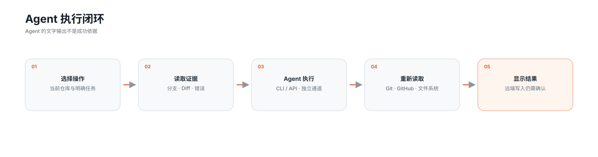
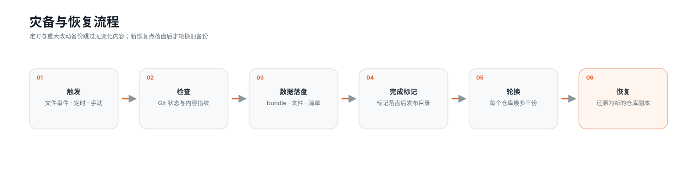
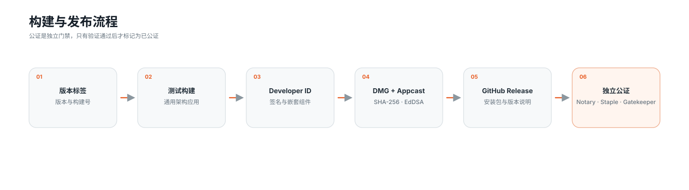

# GitGatto 架构

## 系统图

## 状态所有权

- `WorkspaceViewModel` 在主线程持有当前仓库、工作区、GitHub、目标、回归取证与灾备界面状态。
- `GitHubMarketplaceViewModel` 单独持有应用仓库搜索、详情、翻译与安装状态。
- `DeveloperToolsViewModel` 持有工具探测、安装队列、升级队列和授权重试状态。
- 服务对象执行 Git、网络、进程、文件与更新操作；SwiftUI `body` 不启动这些副作用。
- 同一份可变状态只有一个所有者。长任务通过可取消的 `Task` 返回状态，不用任意延时作为同步条件。

## Git 与仓库边界

`GitRepositoryService` 通过 `GitCommandRunner` 使用参数数组调用系统 Git。仓库读取和写入都绑定到明确的仓库 URL，不拼接 Shell 命令。暂存、提交、Pull、Push、冲突继续、分支和工作树操作均由用户操作或已确认的项目目标触发。

`RepositoryDiscoveryService` 只在用户手动开始扫描后工作。结果必须是当前用户可读写的 Git 仓库，添加前逐项确认；依赖、构建、缓存和系统目录不进入仓库列表。

## GitHub 与凭据

`GitHubService` 使用 GitHub CLI 的标准登录状态调用 API、Fork 和远端操作。GitGatto 不从 CLI 输出中提取令牌，也不把令牌写入设置或日志。公开版本信息由 `GitHubReleaseService` 匿名读取。

PR Review、评论、Fork、Actions 重试或取消等远端写入，必须来自明确的应用操作。搜索、推荐和详情视图只读取当前 API 响应与本机缓存。

## Agent 执行

`CodexService` 为仓库操作、翻译和安装维护独立配置、进程与取消通道。支持 Codex CLI、Claude Code、Gemini CLI、OpenCode 和自定义参数模板。

Agent 结果不是成功依据。项目目标、错误修复、README 重写和安装配置都要回到 Git、GitHub、本机可执行文件或文件系统重新验证。

## 项目目标与回归取证

`ProjectGoalRuntime` 把交付拆成有依赖关系的条件：暂存、提交、Push、Pull Request、Review、Actions、产物与合并。`ProjectReleaseRuntime` 在此基础上核对 README、译文、版本、构建号、更新日志、标签、Release、DMG、Appcast 与本机应用。已完成步骤写入 `ProjectGoalStore`，中断后从未完成条件继续。

`RegressionInvestigationRuntime` 使用 `GitWorktreeService` 创建独立 worktree，再运行 `git bisect`。自动验证以退出码判定，手动验证由用户标记；候选提交、判定、耗时和输出写入 `RegressionInvestigationStore`。当前工作区不会被切换。

## 灾备与恢复

`RepositoryBackupService` 是备份目录的唯一写入者。创建、删除、裁剪与目录迁移在 actor 内串行执行；先写入暂存目录，清单完成后再移动到正式位置。定时与重大变更备份会跳过空工作区和相同内容。更换目录时先复制并比对清单，成功后才切换路径。

## 应用仓库与开发工具

应用仓库由 `GitHubMarketplaceViewModel`、`GitHubService`、`AppDownloadManager` 与 `MacApplicationInstaller` 组成。列表先返回仓库结果，再补齐 Release 与安装包；图片和详情使用有界缓存。DMG 与 ZIP 走本机安装流程，其他格式交给独立安装 Agent。

开发工具由 `DeveloperToolsViewModel` 统一排队：最多三路不同工具任务并发，Homebrew 变更进入单独串行队列。安装后由 `DevelopmentToolEnvironmentConfigurator` 处理当前用户 PATH、组件注册与配置迁移，再由探测服务重新读取版本。需要系统目录修复时，由 `DevelopmentToolSystemAuthorizer` 请求 macOS 授权。

## 持久化与本地数据

- 仓库目录、设置、目标、回归记录、Agent 对话、操作记录、下载和译文保存在应用支持目录。
- 灾备数据默认位于应用支持目录，也可以迁移到用户选择的位置；每个仓库最多保留三份。
- 移除侧边栏仓库只删除目录记录，不删除磁盘仓库或现有恢复点。
- Git、SSH、GitHub CLI 与 Agent CLI 继续使用各自的凭据存储。

## 构建与发布

- `project.yml` 是 Xcode 工程结构的编辑源，`scripts/generate-xcodeproj.sh` 生成 `GitGatto.xcodeproj`。
- `Package.swift` 提供相同源码和依赖的命令行构建入口。
- `AppResourceBundle` 解析 Xcode 主 Bundle、SwiftPM 资源 Bundle 与发行包资源。
- `scripts/package-macos.sh` 构建 Apple Silicon 与 Intel 通用应用并处理嵌套组件签名。
- `.github/workflows/release-macos.yml` 使用 Developer ID 签名、创建 DMG、生成 Appcast 并发布 GitHub Release。
- `.github/workflows/notarize-macos.yml` 是独立的 Apple 公证流程；只有在 App Store Connect 凭据可用并且公证结果通过后，产物才可标记为已公证。

发布命令、凭据边界和验证清单见 [RELEASING.md](RELEASING.md)。
