# GitGatto 路线图

路线图只记录已经实现的能力和已进入计划的下一步。版本是否正式发布以 [CHANGELOG](../CHANGELOG.md) 与 [GitHub Releases](https://github.com/Lincb522/GitGatto/releases) 为准。

```mermaid
flowchart LR
    A[0.14<br/>Git 与 GitHub 基础流程] --> B[0.15–0.16<br/>专业工作区与更新链路]
    B --> C[0.17–0.18.10<br/>Agent、内容预览与工具安装]
    C --> D[0.18.11<br/>目标驱动交付与完整发布]
    D --> E[0.18.12<br/>回归取证与仓库灾备]
    E -.计划.-> F[恢复证据与多仓库值守]
    F -.计划.-> G[可复用 Agent 处理方案]
    G -.计划.-> H[签名、公证与更新闭环]

    classDef shipped fill:#EAF7F3,stroke:#258A73,color:#173C34,stroke-width:1.5px;
    classDef planned fill:#FFF4EA,stroke:#E85D24,color:#5D2A16,stroke-width:1.5px,stroke-dasharray:5 4;
    class A,B,C,D,E shipped;
    class F,G,H planned;
```

## 已实现

| 阶段 | 范围 | 可验证结果 |
| --- | --- | --- |
| 0.14 | 本地 Git、GitHub 账号仓库、搜索、Fork、克隆、Pull Request、Agent、翻译、更新 | 能从真实仓库状态完成暂存、提交、Pull、Push 与远端协作 |
| 0.15–0.16 | 工作树、贮藏、文件历史、诊断、冲突处理、Actions、PR Review、主题与性能 | 可以在应用内完成常见故障处理，并从 GitHub Releases 检查和安装更新 |
| 0.17–0.18.10 | Git 专用 Agent、README 重写、媒体预览、应用仓库、99 种开发工具、并发安装队列 | Agent 操作、翻译和安装互不占用；安装后继续完成当前用户配置与版本验证 |
| 0.18.11 | 项目目标、GitHub 交付、完整发布、自然语言目标 | 暂存、提交、PR、Review、Actions、产物、Release、DMG 与 Appcast 按实际状态逐项核对 |
| 0.18.12 | 回归取证、实时仓库监控、滚动恢复点、备份管理与目录迁移 | `git bisect` 在独立 worktree 中运行；每个仓库最多保留三份可管理、可还原的恢复点 |

## 下一阶段

以下项目尚未作为正式版本发布。

### 恢复证据

- 恢复前查看恢复点中的文件、删除记录与被忽略的大文件。
- 恢复完成后核对 Git 对象、工作区文件与清单，并保留验证结果。
- 支持导出单个恢复点，便于离线保管和在另一台 Mac 上导入。

### 多仓库值守

- 汇总所有已管理仓库的未提交改动、未推送提交、失败的 Actions、进行中的目标和最近恢复点。
- 只对变化的仓库刷新状态，不通过轮询持续启动 Git 进程。
- 从异常项目直接进入对应工作区、目标、回归取证或灾备记录。

### Agent 处理方案

- 将已验证的 Git 修复过程保存为可复用方案，记录适用条件、命令边界和验证命令。
- 执行前展示会读取的仓库、可能修改的路径和需要的权限。
- 在 Agent 修改前创建恢复点；失败时保留输出、变更和重试入口。

### 发布闭环

- 在 Apple 侧凭据可用后，将公证、staple 和 Gatekeeper 验证接入正式发布门禁。
- 对上一正式版本执行“检查更新 → 下载 → 安装 → 重启 → 版本核对”的自动回归。
- 发布页、Appcast、DMG 校验值和应用内版本日志使用同一份版本元数据。

## 不进入路线图的内容

- 没有源码、测试或明确计划依据的功能。
- 只改变宣传文案、但没有可验证行为的项目。
- 绕过 Git、GitHub CLI、Agent CLI 或系统权限模型的自建凭据通道。
